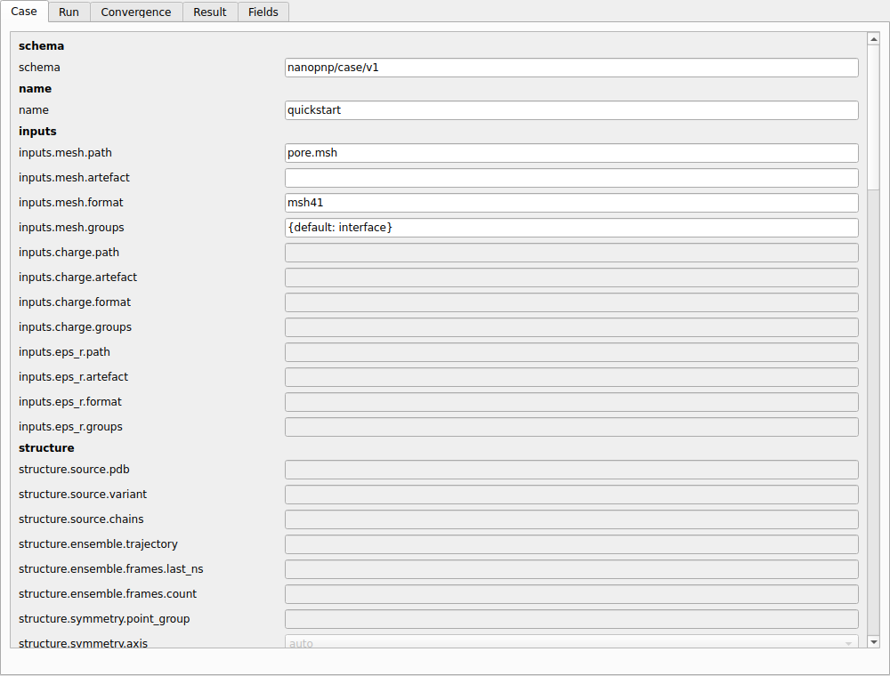
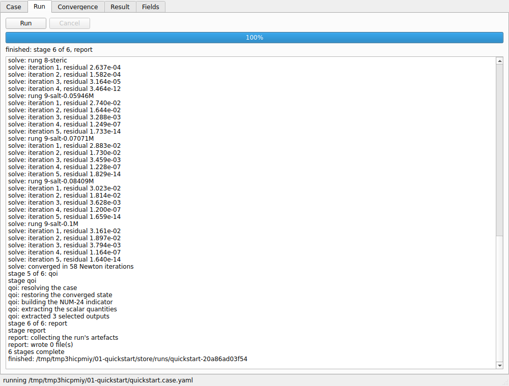
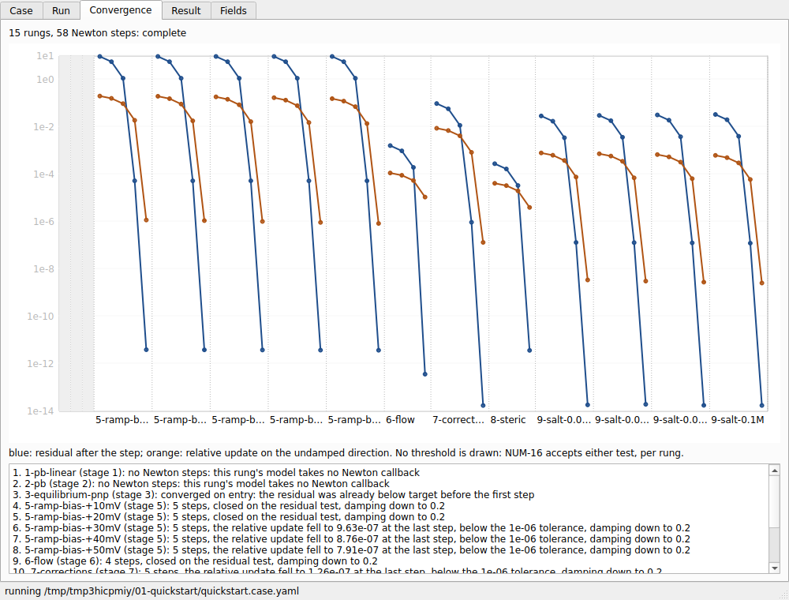

# Desktop shell

`nanopnp-gui` is a desktop application over the same stage objects the command line drives (IF-09,
ADR-004). It holds no physics of its own. It edits a case file, runs it, and shows the result.

```console
$ nanopnp-gui case.yaml
```

It needs the `gui` extra (PySide6). It opens the case you name. A case it cannot open is refused on
standard error with the diagnostic and exit code `nanopnp run` would give, not opened into an empty
form.

!!! note "v0.5: a development install"
    In v0.5, run the shell from a development install (`uv run nanopnp-gui case.yaml`) or a pip
    install with the `gui` extra. A double-clickable Windows bundle of the packaging probe is built
    and self-tested by CI on every push, and it has been confirmed to open and draw on a real
    desktop (§8.2 criterion 4, closed 24 September 2026). Installers for all three platforms come
    after v1.0.

## The five panels



**Case editor.** One form field per editable path of the case schema, generated from the same walk
as the [case-file reference](../_generated/reference/case-file.md). The editor offers only the
values the installed registries admit: correction files, models and stabilisation modes. A value is
checked against its declared type as you type it, and the whole document is re-validated when you
save, with the same diagnostics as the command line.



**Run control.** *Run* saves the case and runs the saved file, so the manifest names a file that
exists. The run is a separate process. The window stays responsive, *Cancel* stops the run at the
next stage or Newton step, and a cancelled run writes nothing to the store.



**Convergence.** Two series for every accepted Newton step, live: the residual, and the relative
update on the undamped direction. They are drawn in one band per continuation rung. The update is
the series that moves on a warm start, where the residual starts at its floor. No threshold line is
drawn, because the solver's convergence test is per rung and uses either series (NUM-16). A band
with no step says why: its rung takes no Newton callback, or it converged on entry.

**Result.** The run record's quantities and the manifest, read from the run directory, which is the
same directory `nanopnp inspect` reads.

**Field viewer.** The solved fields on the mesh, drawn by NGSolve's `webgui` renderer inside the
window. The renderer ships with the package, so no network access is needed. Choose a field and
the viewer draws it over the domain it lives on, with the solid and the fluid kept apart.
