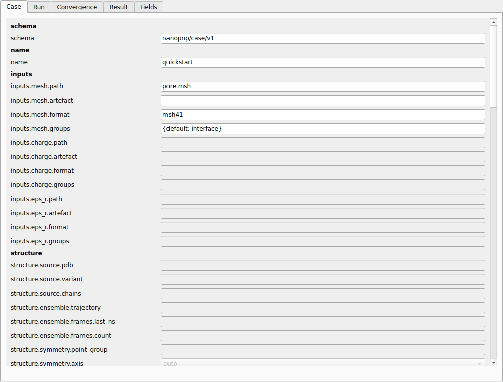
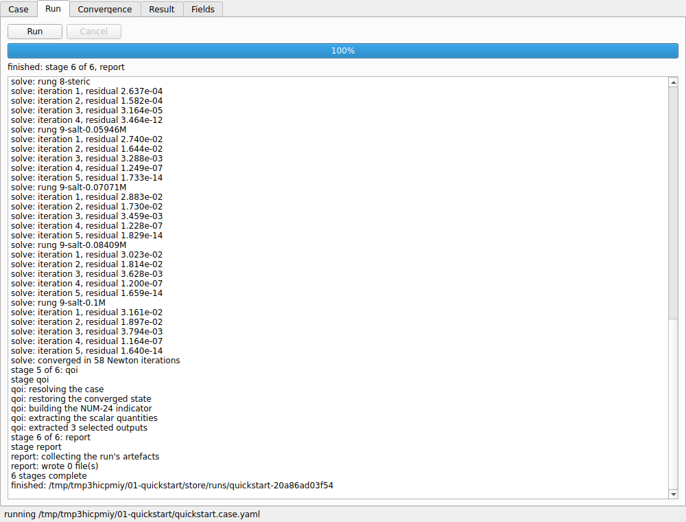
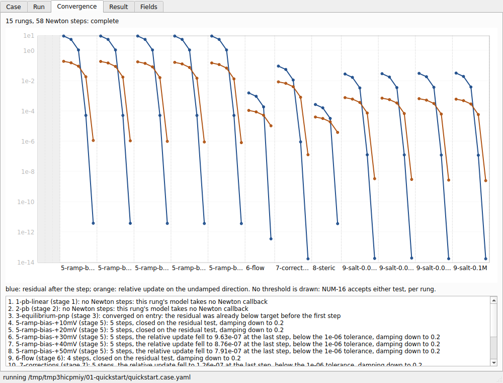

# Desktop shell

`nanopnp-gui` is a desktop application over the same stage objects the command line drives (IF-09,
ADR-004). It holds no physics of its own. It edits a case file, runs it, and shows the result.

```console
$ nanopnp-gui case.yaml
```

It needs the `gui` extra (PySide6). It opens the case you name. A case it cannot open is refused on
standard error with the diagnostic and exit code `nanopnp run` would give, not opened into an empty
form.

!!! note "v0.2: a development install"
    In v0.2, run the shell from a development install (`uv run nanopnp-gui case.yaml`) or a pip
    install with the `gui` extra. A double-clickable Windows bundle of the packaging probe is built
    and self-tested by CI on every push, and it has been confirmed to open and draw on a real
    desktop (§8.2 criterion 4, closed 24 September 2026). Installers for all three platforms come
    after v1.0.

## The seven panels



**Case editor.** One form field per editable path of the case schema, generated from the same walk
as the [case-file reference](../_generated/reference/case-file.md). The editor offers only the
values the installed registries admit: correction files, models and stabilisation modes. A value is
checked against its declared type as you type it, and the whole document is re-validated when you
save, with the same diagnostics as the command line.

A number whose schema gives it both a lower and an upper bound, such as `charge.ph` (0 to 14), is a
spin box over exactly that range. It shows three decimals, and it writes only when you change it,
so a loaded `7.1234` stays `7.1234` in the file. A field whose section the case lacks is greyed out
and marked absent. *Add section: charge* writes an empty `charge:` section, which runs exactly as
no section does, and the pH and force field then become editable. The editor offers this only for a
section whose empty form changes nothing; it never adds a section that would change the physics.

**Geometry.** Stages 1 to 6, built from the shell and shown as each one lands. *Build geometry*
saves the case and runs it as far as the mesh, which is `nanopnp run --upto mesh` in the same
separate process a run uses, and *Cancel* stops it the same way. The build is offered only for a
case that generates its mesh. *Load structure* puts the file you pick into
`structure.source.path`, as an absolute path. Your case needs a `structure:` section, naming the
point group, before it can take a structure.

The list on the left shows each stage's status and the start of its artefact's hash. A stage
already in the store says so. Select a stage to see what it produced:

- **Structure:** the record of what stage 1 aligned.
- **Density:** the axial section through the axis, across the whole diameter, so the asymmetry the
  next stage averages away is visible. It is drawn on a fixed 0 to 1 scale.
- **Symmetry:** the averaged map in (r, z), with its two variances on their own scales.
- **Contour:** the extracted profile, drawn over the averaged map.
- **Region:** the assembled geometry, with the membrane.
- **Mesh:** the mesh, coloured by material, beside its element-quality figures and the location of
  its worst element.

Every picture sits in one of two frames. Stages 1 to 4, and the editor, use the frame of the
structure and of the profile document. The region and the mesh are drawn after the membrane
centre has been moved to z = 0. The caption under each picture names its frame.

**Editing the contour.** The contour pane is also an editor. Drag a vertex to move it,
double-click an edge to add a vertex at its midpoint, and press *Delete* to remove the selected
vertex. *Undo* and *Redo* step through your edits. The editor never smooths or simplifies the
loop. That is stage 4's job, and it is keyed by that stage's own parameters.

An edit that crosses itself, reaches past the axis or repeats a vertex cannot be saved. The pane
shows the loader's reason and names the vertex.

*Measure criteria* checks the edit against §5.2.1's criteria: axis clearance, vertex spacing,
feature size and the radius-profile band. It measures them against the case's own stored stages.
The pane shows the result, and it does not stop you: stages 5 and 6 still apply their own gates.

If stage 4 refused the contour, *Seed from refusal* starts the editor from the loop it refused.
That loop is recomputed from the stored map, and the pane marks the place the refusal names.

*Save edit* writes two files beside your case, and leaves your case unchanged:

- the edit, as a profile document named by its own digest;
- a derived case, `<case>.<profile>.yaml`, which uses that profile in place of the structure.

Open the derived case, or run it from the command line, to mesh and solve the edit. The profile's
provenance records `source: hand-edit`, and the digest and name of what it was edited from. A
hand-edited reference fixture is therefore no longer accepted as the reference.
[Editing the contour by hand](geometry.md#editing-the-contour-by-hand) compares this route with
editing a profile document as text.

**Charge.** Stages 1 to 7, built from the shell. *Build charge* saves the case and runs it as far
as stage 7, `nanopnp run --upto charge`, on the Geometry tab's run control, so that tab's stage
list fills in as well, and *Cancel* stops either. The build is offered for a case that generates
its mesh and carries a charge, from a `structure:` or from `inputs.pqr`, and a greyed-out button
says why it is not. The list on the left shows stage 7's two halves, protonation and the charge
itself, with each artefact's hash. Every number in the four panes is read from those artefacts:

- **Protonation:** one row per titratable group in the selected frame, with its chain, residue,
  applied charge, pKa and the charge PROPKA expects at the pH. A state PDB2PQR could not apply,
  such as `CYS⁻` under CHARMM or a terminal pKa, is flagged *unapplied*, as recorded. Below the
  table are `Q_net` per frame, any per-chain differences and PDB2PQR's warnings. A supplied PQR
  shows its own charges, with the pKa marked as not computed.
- **Charge map:** the deposited areal charge density in (r, z), in the model frame, on a red–blue
  scale centred on zero. Large lattices are shown as block means, and the picture still carries
  the recorded charge. The worst planes of the per-plane check are marked as dashed lines.
- **Deployed field:** the charge density the solve assembles on the mesh, or the solid fraction χ
  where the case derives one, drawn by the same `webgui` renderer as the field viewer. It is drawn
  in a separate process into the run's `viewer/` directory and is never stored as an artefact.
- **Conservation:** each leg of the conservation report, with its value, its tolerance and the
  share of the tolerance it uses. A leg the stage did not run is shown as not run, with its reason.

A later geometry build that replaces the model clears the Charge tab until you build charge again.



**Run control.** *Run* saves the case and runs the saved file, so the manifest names a file that
exists. The run is a separate process. The window stays responsive, *Cancel* stops the run at the
next stage or Newton step, and a cancelled run writes nothing to the store.



**Convergence.** Two series for every accepted Newton step, live: the residual, and the relative
update on the undamped direction. They are drawn in one band per continuation rung. The update is
the series that moves on a warm start, where the residual starts at its floor. No threshold line is
drawn, because the solver's convergence test is per rung and uses either series (NUM-16). A band
with no step says why: its rung takes no Newton callback, or it converged on entry.

**Result.** The run record's quantities and the manifest, read from the run directory, which is the
same directory `nanopnp inspect` reads.

**Field viewer.** The solved fields on the mesh, drawn by NGSolve's `webgui` renderer inside the
window. The renderer ships with the package, so no network access is needed. Choose a field and
the viewer draws it over the domain it lives on, with the solid and the fluid kept apart.
